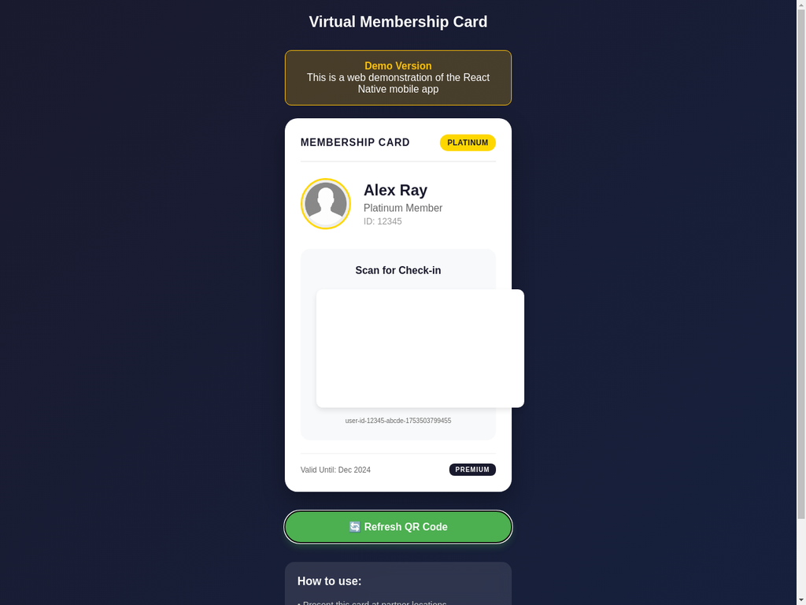

# Virtual Membership Card - React Native App

A beautiful and functional mobile application that displays a virtual membership card with dynamic QR code generation for seamless check-in processes.

## 🎯 Overview

This React Native application provides users with a digital membership card featuring:
- **Professional UI Design**: Elegant card layout with user profile information
- **Dynamic QR Code Generation**: Real-time QR code creation and refresh functionality
- **Time-Sensitive Security**: QR codes update with timestamps for enhanced security
- **Cross-Platform Compatibility**: Built with React Native for iOS and Android

## ✨ Features

### 🎨 UI Design
- **Visually Appealing Card Layout**: Professional membership card design
- **User Profile Section**: 
  - Static user name display ("Alex Ray")
  - Membership level indicator ("Platinum Member")
  - Circular profile picture placeholder
  - Member ID display
- **Premium Styling**: 
  - Gradient background
  - Card shadows and rounded corners
  - Gold platinum badge
  - Responsive design for all screen sizes

### 🔄 QR Code Functionality
- **Dynamic Generation**: Uses `react-native-qrcode-svg` library
- **Base User ID**: `user-id-12345-abcde`
- **Timestamp Integration**: Appends current timestamp on refresh
- **Real-time Updates**: Instant QR code regeneration
- **Security Enhancement**: Time-sensitive tokens for secure access

### 📱 Interactive Elements
- **Refresh Button**: Prominent button below the card
- **Visual Feedback**: Button animation and status updates
- **Touch-Friendly**: Optimized for mobile interaction
- **Accessibility**: Clear labels and intuitive design

## 🛠️ Tech Stack

- **Framework**: React Native 0.80.2
- **QR Code Library**: `react-native-qrcode-svg`
- **SVG Support**: `react-native-svg`
- **State Management**: React Hooks (useState)
- **Styling**: React Native StyleSheet

## 📦 Installation & Setup

### Prerequisites
- Node.js (v14 or higher)
- React Native CLI
- Android Studio (for Android development)
- Xcode (for iOS development)

### Installation Steps

1. **Clone the Repository**
   ```bash
   git clone https://github.com/yourusername/membership-card-app.git
   cd membership-card-app
   ```

2. **Install Dependencies**
   ```bash
   npm install
   ```

3. **Install iOS Dependencies** (iOS only)
   ```bash
   cd ios && pod install && cd ..
   ```

4. **Run the Application**
   
   For Android:
   ```bash
   npx react-native run-android
   ```
   
   For iOS:
   ```bash
   npx react-native run-ios
   ```

## 🚀 Usage

1. **Launch the App**: Open the application on your mobile device
2. **View Membership Card**: The card displays user information and current QR code
3. **Scan QR Code**: Partners can scan the QR code for verification
4. **Refresh QR Code**: Tap the "Refresh QR Code" button to generate a new time-sensitive code
5. **Security**: Each refresh creates a unique QR code with current timestamp

## 🎥 Demo

### Web Demo
A web demonstration is available at `index.html` showing the app's functionality in a browser environment.

### QR Code Refresh Demonstration

**Initial State:**

*QR Code Value: `user-id-12345-abcde`*

**After Refresh:**

*QR Code Value: `user-id-12345-abcde-1753037996955` (with timestamp)*

The application demonstrates dynamic QR code generation:
- **Initial QR Code**: `user-id-12345-abcde`
- **After Refresh**: `user-id-12345-abcde-[timestamp]`
- **Example**: `user-id-12345-abcde-1753037996955`

### Key Features Demonstrated:
- ✅ Professional membership card design
- ✅ Dynamic QR code generation
- ✅ Real-time QR code refresh with timestamp
- ✅ Responsive mobile-first design
- ✅ Visual feedback on button interaction

## 🏗️ Project Structure

```
MembershipCardApp/
├── App.js                 # Main application component
├── assets/
│   └── profile_placeholder.png  # Profile picture placeholder
├── android/               # Android-specific files
├── ios/                   # iOS-specific files
├── index.html            # Web demo version
├── package.json          # Dependencies and scripts
└── README.md            # This documentation
```

## 🎨 Design Specifications

### Color Palette
- **Primary Background**: `#1a1a2e` (Dark Navy)
- **Card Background**: `#ffffff` (White)
- **Platinum Badge**: `#ffd700` (Gold)
- **Refresh Button**: `#4CAF50` (Green)
- **Text Primary**: `#1a1a2e` (Dark Navy)
- **Text Secondary**: `#666666` (Gray)

### Typography
- **Header**: 24px, Bold
- **User Name**: 24px, Bold
- **Card Title**: 16px, Bold, Letter Spacing
- **Body Text**: 14-16px, Regular
- **Small Text**: 10-12px, Regular

### Layout
- **Card Width**: Full width with 20px margins
- **Card Padding**: 20px
- **Border Radius**: 20px for card, 15px for sections
- **Profile Image**: 80x80px, circular with gold border
- **QR Code**: 150x150px with white background

## 🔧 Technical Implementation

### State Management
```javascript
const [qrValue, setQrValue] = useState('user-id-12345-abcde');

const refreshQRCode = () => {
  const timestamp = Date.now();
  const newQrValue = `user-id-12345-abcde-${timestamp}`;
  setQrValue(newQrValue);
};
```

### QR Code Generation
```javascript
<QRCode
  value={qrValue}
  size={150}
  color="#1a1a2e"
  backgroundColor="#ffffff"
/>
```

## 📋 Requirements Compliance

✅ **Tech Stack**: React Native implementation  
✅ **UI Design**: Professional card layout with all required elements  
✅ **QR Code Library**: `react-native-qrcode-svg` integration  
✅ **Dynamic Generation**: Real-time QR code updates  
✅ **Refresh Functionality**: Button-triggered QR code regeneration  
✅ **State Management**: Proper React state handling  
✅ **User Information**: Static display of name and membership level  
✅ **Profile Picture**: Circular placeholder implementation  
✅ **Timestamp Integration**: Security-enhanced QR codes  

## 🎥 Demo Video

[Demo video/GIF will be included showing the application functionality and QR code refresh feature]

## 🚀 Deployment

The application is ready for deployment to:
- **Google Play Store** (Android)
- **Apple App Store** (iOS)
- **Internal Distribution** (Enterprise)

## 🤝 Contributing

1. Fork the repository
2. Create a feature branch
3. Commit your changes
4. Push to the branch
5. Create a Pull Request

## 📄 License

This project is licensed under the MIT License - see the LICENSE file for details.

## 📞 Support

For support and questions, please contact:
- **Email**: support@membershipcard.app
- **Issues**: GitHub Issues page

---

**Built with ❤️ using React Native**

